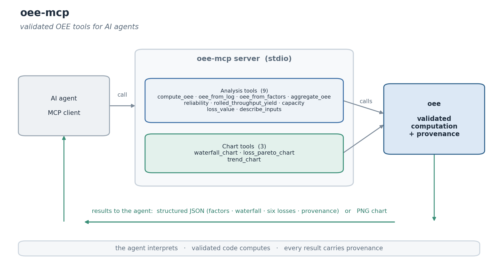

<!-- mcp-name: io.github.arikanatakan/oee-mcp -->

# oee-mcp

[](https://github.com/arikanatakan/oee-mcp/actions/workflows/ci.yml)
[](https://pypi.org/project/oee-mcp/)
[](LICENSE)

An MCP server that exposes [oee](https://github.com/arikanatakan/oee), the
Overall Equipment Effectiveness library for Python, as tools for AI agents: give
it machine times and piece counts and it returns OEE, the time waterfall, the
six big losses, TEEP, and ready-to-show charts.

Agents asked to compute or report OEE tend to do the arithmetic themselves: a
performance figure inverted, schedule loss left out, or - the usual mistake -
OEE figures averaged across machines, which is wrong. Generated OEE fails
silently. The calculation belongs in a deterministic, versioned, validated
library that the agent calls, which leaves the agent to choose the analysis and
explain the result.



## Tools

**Analysis tools** return the library's payload: the factors, the time
waterfall, the six big losses, TEEP, alerts and provenance.

| Tool | Purpose |
| ---- | ------- |
| `compute_oee` | OEE, OOE and TEEP, the waterfall and the six big losses from times and counts |
| `oee_from_log` | OEE from an event log of production runs and downtime events |
| `oee_from_factors` | OEE from availability, performance and quality directly |
| `aggregate_oee` | roll OEE up across machines or shifts correctly (sums the buckets, never averages) |
| `reliability` | MTBF, MTTR and inherent availability |
| `rolled_throughput_yield` | the multi-step quality view (the product of the step yields) |
| `capacity` | takt time, the required rate, and whether a cycle time keeps up |
| `loss_value` | the availability, performance and quality losses as lost units and money |
| `describe_inputs` | the input fields, units and the metric definitions |

**Chart tools** return a PNG image.

| Tool | Purpose |
| ---- | ------- |
| `waterfall_chart` | the OEE time waterfall |
| `loss_pareto_chart` | a Pareto of the six big losses |
| `trend_chart` | OEE and the factors over a sequence of shifts |

All tools are read-only.

## Installation

Run it with [uv](https://docs.astral.sh/uv/) (no install needed):

```
uvx oee-mcp
```

or install from PyPI:

```
pip install oee-mcp
```

## Configuration

Add it to your MCP client. For example:

```json
{
  "mcpServers": {
    "oee": {
      "command": "uvx",
      "args": ["oee-mcp"]
    }
  }
}
```

If you installed with pip, use `"command": "oee-mcp"` with no args.

## Example

```
compute_oee(machine={
  "planned_production_time": 420, "downtime": 47, "ideal_rate": 60,
  "total_count": 19271, "reject_count": 423, "all_time": 480
})
  -> { "factors": { "availability": 0.888, "performance": 0.861,
                    "quality": 0.978, "oee": 0.748, "teep": 0.654 },
       "summary": "oee - ...\n  OEE 74.8% ..." }
```

## Design

The server is a thin, stateless wrapper. All of the arithmetic lives in the oee
library, which computes OEE from the standard definitions and is validated
against published worked examples (Vorne, TeepTrak) and the Nakajima world-class
benchmark. The server adds the tool schema, read-only annotations and an
input-schema helper so an agent can format the input and act on the result.

## Related

- [oee](https://github.com/arikanatakan/oee): the library this server wraps.

## License

MIT. Written and maintained by [Atakan Arikan](https://github.com/arikanatakan),
MSc Student at Tsinghua University and Politecnico di Milano.
